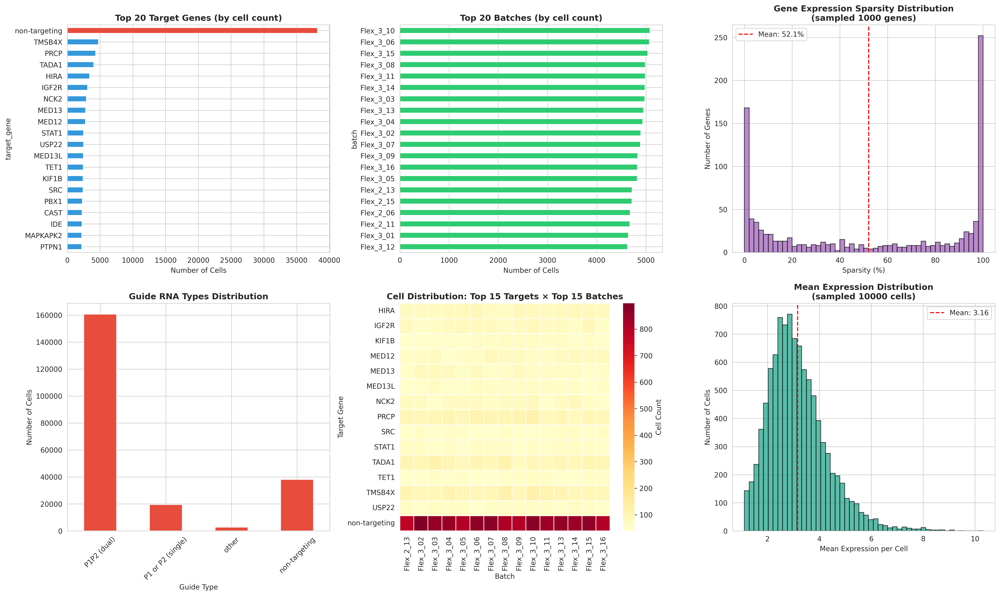
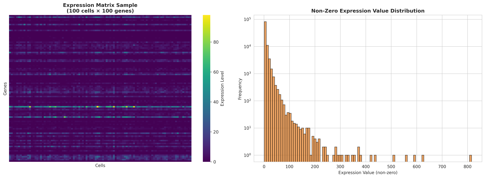

# VCC Raw Data Overview

This page provides a comprehensive introduction to the raw data files used in this project. For project context, see `docs/project-intro/introduction.md`.

## Data Files Location

All raw data is stored in `data/raw/`:

| File | Type | Purpose |
|------|------|---------|
| `adata_Training.h5ad` | AnnData H5AD | Single-cell expression matrix with cell/gene metadata |
| `gene_names.csv` | CSV | Ordered list of 18,079 gene symbols |
| `pert_counts_Validation.csv` | CSV | Validation set statistics: cell counts and sequencing depth |

---

## Training Expression Matrix: `adata_Training.h5ad`

### Overview

The main training dataset containing single-cell RNA-seq profiles of H1 human embryonic stem cells (hESCs) under CRISPR gene perturbations.

### Dimensions and Format

| Property | Value |
|----------|-------|
| Cells (observations) | 221,273 |
| Genes (variables) | 18,080 |
| Expression matrix type | Sparse CSR matrix (`scipy.sparse.csr_matrix`) |
| Data type | float32 |
| Sparsity | ~51.69% zeros |
| File size | ~7.2 GB (compressed) |

### Annotations (Observations - Cells)

Each cell contains three key metadata fields:

| Field | Description | Values |
|-------|-------------|--------|
| `target_gene` | Gene targeted by CRISPR knockout | 151 unique (150 perturbed + 1 non-targeting control) |
| `guide_id` | Specific paired guide RNA identifier | 189 unique combinations |
| `batch` | Experimental batch identifier | 48 unique batches |

**Cell Distribution:**
- Control (non-targeting): ~38,176 cells (~17%)
- Perturbed (specific targets): ~183,097 cells (~83%)
- Average cells per batch: ~4,610

### Annotations (Variables - Genes)

Each gene entry contains:

| Field | Description |
|-------|-------------|
| `gene_id` | Ensembl gene identifier (e.g., `ENSG00000187634`) |
| Gene index (row name) | Gene symbol (e.g., `SAMD11`, `TP53`) |

Coverage includes protein-coding genes and mitochondrial genes (MT-encoded).

### Expression Values

The expression matrix `X` contains read counts or normalized expression values:

- **Min value:** 1.0
- **Max value:** 392.0
- **Mean:** 6.5
- **Median:** 3.0
- **Non-zero elements:** ~1.93 billion (48.31% of total possible values)

### Loading and Exploring

```python
import anndata as ad

# Load the file
adata = ad.read_h5ad("data/raw/adata_Training.h5ad")

# View structure
print(adata)
print(adata.shape)
print(adata.X.dtype)

# Inspect metadata
print(adata.obs.head())
print(adata.var.head())

# Access expression for specific cells/genes
subset = adata[:100, :50]
```

---

## Gene Names Reference: `gene_names.csv`

### Overview

A simple CSV file containing an ordered list of gene symbols matching the gene dimension of the training matrix.

### Specifications

| Property | Value |
|----------|-------|
| Format | CSV (single column, no header) |
| Number of entries | 18,079 genes |
| Gene type | Ensembl-indexed human gene symbols |
| Order | Consistent with `adata.var` index (except first gene) |

### Gene Listing

- **Early genes:** SAMD11, NOC2L, KLHL17, PERM1, HES4, ISG15, AGRN
- **Mitochondrial genes:** MT-ND2, MT-CO2, MT-ATP6, MT-CO3, MT-ND3, MT-ND4L, MT-ND4, MT-ND5, MT-ND6, MT-CYB

### Usage

```python
import pandas as pd

# Load gene names
gene_names = pd.read_csv("data/raw/gene_names.csv", header=None).squeeze().tolist()

print(f"Total genes: {len(gene_names)}")
print(f"First genes: {gene_names[:5]}")
print(f"Last genes: {gene_names[-5:]}")

# Use for indexing
important_genes = ["TP53", "BRCA1", "CDKN1A"]
gene_indices = [gene_names.index(g) for g in important_genes if g in gene_names]
```

### Important Notes

- **Count mismatch:** 18,079 genes in CSV vs. 18,080 in the h5ad matrix. Verify alignment when combining files.
- **All entries are unique** — no duplicate gene symbols.

---

## Validation Perturbation Summary: `pert_counts_Validation.csv`

### Overview

Summary statistics for the 50 genes in the validation set, including cell counts and RNA sequencing depth (UMI - Unique Molecular Identifiers).

### Specifications

| Property | Value |
|----------|-------|
| Format | CSV |
| Number of genes | 50 (validation target set) |
| Columns | `target_gene`, `n_cells`, `median_umi_per_cell` |

### Column Descriptions

| Column | Type | Description |
|--------|------|-------------|
| `target_gene` | String | Name of the perturbed gene |
| `n_cells` | Integer | Number of cells sequenced for this perturbation |
| `median_umi_per_cell` | Float | Median number of UMIs (transcripts) detected per cell |

### Statistics Summary

| Metric | n_cells | median_umi_per_cell |
|--------|---------|---------------------|
| Minimum | 161 | 38,650 |
| 25th percentile | 685 | 53,221 |
| Median | 1,091 | 54,447 |
| Mean | 1,215 | 54,082 |
| 75th percentile | 1,634 | 55,351 |
| Maximum | 2,925 | 63,176 |

**Key Observation:** Median UMI values are stable (~54k) across all genes, indicating consistent sequencing quality across the validation set.

### Top and Bottom Perturbations (by cell count)

**Top 5:**

| Target Gene | Cell Count | Median UMI/Cell |
|-------------|------------|-----------------|
| SH3BP4 | 2,925 | 54,551 |
| ZNF581 | 2,502 | 53,804 |
| ANXA6 | 2,496 | 55,175 |
| PACSIN3 | 2,101 | 54,088 |
| MGST1 | 2,096 | 54,218 |

**Bottom 5:**

| Target Gene | Cell Count | Median UMI/Cell |
|-------------|------------|-----------------|
| EIF3H | 323 | 53,504 |
| FUBP1 | 288 | 55,334 |
| WAC | 267 | 60,363 |
| ZNF598 | 255 | 54,046 |
| MAX | 161 | 38,650 |

### Usage Example

```python
import pandas as pd

# Load validation data
df_val = pd.read_csv("data/raw/pert_counts_Validation.csv")

# Sort by cell count (descending)
print(df_val.sort_values("n_cells", ascending=False).head(10))

# Filter for high-coverage genes
high_coverage = df_val[df_val["n_cells"] >= 1500]
print(f"High-coverage genes ({1500}+ cells): {len(high_coverage)}")

# Summary statistics
print(df_val.describe())
```

---

## AnnData Structure Reference

The H5AD file structure at a glance:

```
adata (AnnData object)
├── X: Sparse CSR matrix (221,273 cells × 18,080 genes)
│   └── dtype: float32, ~51.69% zeros
├── obs: Cell-level metadata (221,273 rows)
│   ├── target_gene (category: 151 unique)
│   ├── guide_id (category: 189 unique)
│   └── batch (category: 48 unique)
├── var: Gene-level metadata (18,080 rows)
│   └── gene_id (Ensembl identifiers)
├── uns: Unstructured metadata (empty)
├── obsm: Multi-dimensional cell annotations (empty)
├── varm: Multi-dimensional gene annotations (empty)
├── obsp: Pairwise cell relationships (empty)
└── varp: Pairwise gene relationships (empty)
```

---

## Visual Overview

### H5AD Structure



### Expression Matrix Details



---

## Integration with the Project

### How This Data Fits

- **Goal:** Learn from 150 training genes to predict transcriptomic responses for 50 validation and 100 test genes (see `docs/project-intro/introduction.md`).
- **Training Input:** Use `adata_Training.h5ad` for model fitting and validation on unseen perturbations.
- **Supporting Files:** 
  - Use `gene_names.csv` for consistent gene indexing across utilities.
  - Use `pert_counts_Validation.csv` to understand validation coverage and prioritize data quality.

### Quick-Start Scripts

Located in `scripts/`:

| Script | Purpose |
|--------|---------|
| `visualize_h5ad.py` | Interactive exploration: inspect dims, view distributions, plot PCA/UMAP |
| `preview_data.py` | Fast data checks: display CSV shapes, sample rows, basic stats |

---

## Key Insights

1. **Large-scale, well-controlled dataset:** 221k cells with ~17% untouched controls for baseline comparison.
2. **Multi-batch experimental design:** 48 batches mitigate single-batch biases.
3. **Efficient storage:** Sparse format saves ~52% memory; suitable for large-scale model training.
4. **Consistent quality:** Median UMI across validation set is stable (~54k), confirming reliable sequencing.
5. **Full transcriptome coverage:** All protein-coding genes plus mitochondrial genes included.
6. **Sparse expression pattern:** ~52% zeros reflect biological sparsity in single-cell RNA-seq (many genes have zero or low counts per cell).