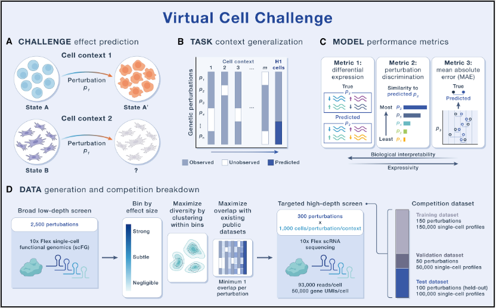

# Project 6: Predicting the Response of Cellular Transcriptome to Gene Perturbations

## Persons of Contact

- **Prof. Jie Zheng** (郑杰)  
  Email: zhengjie@shanghaitech.edu.cn

- **Dr. Lichun Jiang** (蒋立春)  
  Email: jianglch@shanghaitech.edu.cn

- **TA: Mr. Yimiao Feng** (冯艺苗)  
  Email: fengym1@shanghaitech.edu.cn

---

## Background

Cells, as fundamental units that make up the human body, have complex mechanisms within them. Understanding the relationship between the cell state and function, as well as predicting the consequences of interference such as gene knockout or drug application in different cell types and environments, requires extensive biological experiments. Although with the rapid development of single-cell sequencing and CRISPR technology, researchers can measure the response of cells to gene perturbations at large-scale, the high experimental cost and limited throughput have hindered the systematic testing of all perturbations in various cell types.

As early as the late 1990s, researchers had attempted to build "whole-cell" computational models from first principles. However, those efforts stalled because data were sparse, biological assumptions were oversimplified, and compute power was limited. Three decades later, the convergence of large-scale single-cell atlases, rich perturbation compendia, and modern machine-learning hardware/algorithms has revived this ambition. In 2024, Bunne, Charlotte et al. [[1](#references)] formalized the concept of **AI Virtual Cell (AIVC)**: a multi-scale, multi-modal neural network model able to represent and simulate molecular, cellular and tissue-level behaviors under all different physiological or pathological states.

A growing number of methods, including **CPA** [[2](#references)], **scGen** [[3](#references)], **GEARS** [[4](#references)], **scGPT** [[5](#references)], and **PerturbNet** [[6](#references)], etc., have already been able to predict transcriptional responses to gene knock-outs or knock-downs. However, recent benchmarks [[7](#references)], [[8](#references)] show that no single approach dominates across all evaluation axes, suggesting that perturbation-response prediction is still far from solved. To accelerate progress in this field, the Arc Institute launched the **Virtual Cell Challenge (VCC)** [[9](#references)]. The competition provides a rigorously curated dataset that profiles ~300,000 H1 human embryonic stem cells (hESCs) exposed to 300 distinct genetic perturbations, and invites the community to build models that generalize to unseen genes and unseen interventions.

### Virtual Cell Challenge Overview

**Figure 1:** Overview of the Virtual Cell Challenge (VCC).

---

## Goal

In this course project, you will develop a deep-learning system that learns from the VCC training set and predicts the transcriptome responses of H1 hESCs to previously unobserved single-gene perturbations.

---

## Learning Objectives

- ✓ Master the processing workflow of single-cell RNA seq data
- ✓ Build a deep learning model to predict the transcriptome effects of given gene perturbations in cells
- ✓ Evaluate your model using the official VCC metric (see below) and achieve an overall score of at least 8.0

---

## Suggested Methods

Choose one or propose your own ideas:

1. **Foundation Models**: Finetune pre-trained single-cell foundation models (such as scGPT [[5](#references)], Geneformer [[10](#references)], scBERT [[11](#references)]) using appropriate downstream tasks.

2. **Conditional VAE**: Based on the conditional variational autoencoder (cVAE), treat perturbed genes as conditional latent variables, and learn a distributional mapping from control to perturbed state.

3. **Novel Architectures**: Design a new prediction model for perturbation response based on basic frameworks such as Transformer or Diffusion models.

4. **Graph-based Methods**: Integrate gene regulatory networks (GRNs) or protein-protein interaction (PPI) modeling based on a graph neural network (GNN).

---

## Data Resources

### Official VCC Dataset

| Dataset | Description |
|---------|-------------|
| **Training** | 150 genes (~150,000 cells) |
| **Validation** | 50 genes (live leaderboard) |
| **Test** | 100 held-out genes (final ranking) |
| **Reference** | Matched unperturbed H1 hESC profiles |

### Optional Augmentation

- **scBaseCount**: 230 M cells
- **Tahoe-100M**: Perturbation compendium
- **Public GEO / Single-Cell-Portal**: Perturbation studies

---

## Evaluation Metrics

- **Differential-Expression Score (DES)**: Evaluates how accurately a model predicts differential gene expression.

- **Perturbation-Discrimination Score (PDS)**: Measures a model's ability to distinguish between perturbations by ranking predictions according to their similarity to the true perturbational effect, regardless of their effect size.

- **Mean Absolute Error (MAE)**: Evaluates the overall accuracy of the predicted expression profile.

- **Overall Score**: Determined by averaging the improvement of the three metrics relative to a baseline based on the cell-mean model of the training dataset.

**For detailed definitions of indicators, visit:** https://virtualcellchallenge.org/evaluation

---

## Stretch Goals (Bonus)

- **Cross-cell-type Generalization**: Fine-tune on H1 hESC, then zero-shot predict responses in iPSC or K562 cells.
- **Combinatorial Perturbations**: Predict the transcriptional outcome of double-knock-out experiments.
- **Inverse Design**: Given a desired expression signature, retrieve the minimal gene perturbation that produces it.

---

## Useful Links

- **Virtual Cell Challenge Home**: https://virtualcellchallenge.org/
- **scBaseCount**: https://github.com/ArcInstitute/arc-virtual-cell-atlas/tree/main/scBaseCount
- **Tahoe-100M**: https://github.com/ArcInstitute/arc-virtual-cell-atlas/tree/main/tahoe-100M
- **PerturbArena**: https://luyitian.github.io/PerturbArena/index.html
- **Systema**: https://brbiclab.epfl.ch/projects/systema/

---

## References

[1] C. Bunne et al., 'How to build the virtual cell with artificial intelligence: Priorities and opportunities', *Cell*, vol. 187, no. 25, pp. 7045–7063, Dec. 2024, doi: 10.1016/j.cell.2024.11.015.

[2] M. Lotfollahi et al., 'Predicting cellular responses to complex perturbations in high‐throughput screens', *Mol. Syst. Biol.*, vol. 19, no. 6, p. e11517, June 2023, doi: 10.15252/msb.202211517.

[3] M. Lotfollahi, F. A. Wolf, and F. J. Theis, 'scGen predicts single-cell perturbation responses', *Nat. Methods*, vol. 16, no. 8, pp. 715–721, Aug. 2019, doi: 10.1038/s41592-019-0494-8.

[4] Y. Roohani, K. Huang, and J. Leskovec, 'Predicting transcriptional outcomes of novel multigene perturbations with GEARS', *Nat. Biotechnol.*, vol. 42, no. 6, pp. 927–935, June 2024, doi: 10.1038/s41587-023-01905-6.

[5] H. Cui et al., 'scGPT: Toward building a foundation model for single-cell multi-omics using generative AI', *Nat. Methods*, vol. 21, no. 8, pp. 1470–1480, Aug. 2024, doi: 10.1038/s41592-024-02201-0.

[6] H. Yu and J. D. Welch, 'PerturbNet predicts single-cell responses to unseen chemical and genetic perturbations', July 22, 2022, bioRxiv. doi: 10.1101/2022.07.20.500854.

[7] R. Viñas Torné et al., 'Systema: a framework for evaluating genetic perturbation response prediction beyond systematic variation', *Nat. Biotechnol.*, pp. 1–10, Aug. 2025, doi: 10.1038/s41587-025-02777-8.

[8] L. Li et al., 'A Systematic Comparison of Single-Cell Perturbation Response Prediction Models', Sept. 16, 2025, bioRxiv. doi: 10.1101/2024.12.23.630036.

[9] Y. H. Roohani et al., 'Virtual Cell Challenge: Toward a Turing test for the virtual cell', *Cell*, vol. 188, no. 13, pp. 3370–3374, June 2025, doi: 10.1016/j.cell.2025.06.008.

[10] Z. Cui, Y. Liao, T. Xu, and Y. Wang, 'GeneFormer: Learned Gene Compression using Transformer-based Context Modeling', Jan. 31, 2023, arXiv: arXiv:2212.08379. doi: 10.48550/arXiv.2212.08379.

[11] F. Yang et al., 'scBERT as a large-scale pretrained deep language model for cell type annotation of single-cell RNA-seq data', *Nat. Mach. Intell.*, vol. 4, no. 10, pp. 852–866, Oct. 2022, doi: 10.1038/s42256-022-00534-z.
