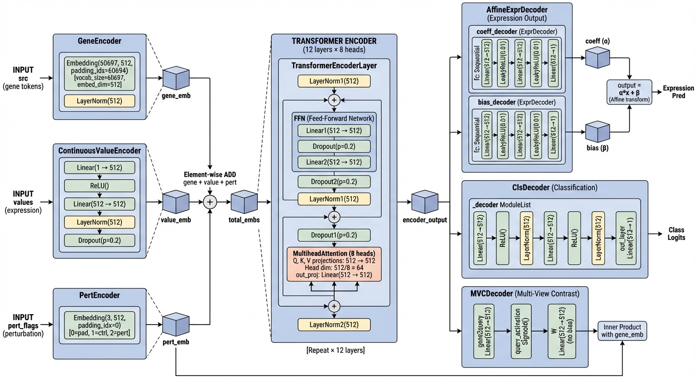

## scGPT

### Slides

### Speech Draft: scGPT Finetuning for Perturbation Prediction

**Introduction**
We leverage **scGPT**, a foundation model pre-trained on over 33 million single-cell data points, to predict cellular responses to genetic perturbations. By finetuning this model, we adapt its general knowledge of gene networks to the specific task of forecasting how a cell changes when a gene is knocked out or overexpressed.

**Architecture & Workflow**
As shown in the architecture diagram:
1.  **Input Representation**: The model treats a single cell like a sentence. It takes three key inputs:
    *   **Gene Tokens**: Representing the gene identity.
    *   **Expression Values**: The continuous activity level of each gene.
    *   **Perturbation Tokens**: A special condition token indicating the specific genetic perturbation (e.g., a CRISPR knockout).

2.  **Transformer Encoder**: These inputs are embedded and processed by a **Transformer Encoder**. This core component captures the complex, non-linear interactions between genes and how the perturbation signal propagates through the gene regulatory network.

3.  **Prediction**: A **Decoder** then projects these learned representations back to predict the post-perturbation gene expression profile.

**Finetuning Process**
Our implementation (`src/finetune.py`) follows a rigorous pipeline:
*   **Initialization**: We start with weights from the `scGPT_human` foundation model, enabling transfer learning.
*   **Training Objective**: It learns to minimize the Mean Squared Error (MSE) between its predicted gene expression values and the actual experimental data.
*   **Pre-trained & Updated**: The `Gene Encoder`, `Value Encoder`, and `Transformer Encoder` are initialized with weights from the foundational `scGPT_human` model.
*   **Initialized from Scratch & Updated**: The `Perturbation Encoder` and the prediction `Decoder` are initialized randomly and trained from scratch to capture the specific effects of genetic perturbations.